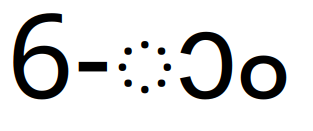

<section lang="ml" class="font-manjari">
മലയാളത്തിൽ തിയ്യതികളും അക്കങ്ങളും എഴുതുമ്പോൾ ആം ചിഹ്നം ചേർത്തെഴുതാറുണ്ട്. ഉദാഹരണത്തിന് 5-ാം , 16-ാം  എന്നിങ്ങനെ.

## ഏങ്ങനെ എഴുതാം

ഇത് ടൈപ്പു ചെയ്യാൻ ഇൻസ്ക്രിപ്ട് ആണ് ഉപയോഗിക്കുന്നതെങ്കിൽ 16-ex എന്ന് ടൈപ്പ് ചെയ്താൽ മതി. സ്വനലേഖയാണെങ്കിൽ 16-@aam2 എന്നോ 16-@Am~ എന്നോ ഉപയോഗിക്കാം.

5-ാം , 16-ാം 

## കുത്തുവട്ടം വരുന്നതെന്തുകൊണ്ട്

> മഞ്ജരി, ചിലങ്ക, ഗായത്രി, സുറുമ എന്നീ ഫോണ്ടുകളുടെ ഏറ്റവും പുതിയ പതിപ്പുകളിൽ കുത്തുവട്ടം വരില്ല. ഇവയുടെ പുതിയ പതിപ്പുകൾ ഉപയോഗിക്കാൻ ശ്രദ്ധിക്കുക.

ചില അപ്ലിക്കേഷനുകളിൽ ഇങ്ങനെ എഴുതുമ്പോൾ ാം ചിഹ്നത്തിനു മുമ്പ് കുത്തിട്ട ഒരു വട്ടം താഴെ ചിത്രത്തിൽ കൊടുത്തിരിക്കുന്ന പോലെ വരുന്നതുകാണാം

ലിബ്രെ ഓഫീസ്, ഓപ്പൺ ഓഫീസ് എന്നിവ ഈ പ്രശ്നം കാണിക്കുന്നവയാണ്. എന്നാൽ ബ്രൗസറുകളോ മറ്റ് മിക്ക അപ്ലിക്കേഷനുകളിലോ ഈ പ്രശ്നം കാണാറില്ല. ഈ പേജിൽ തന്നെ നിങ്ങൾ ഇവ കുത്തുവട്ടമില്ലാതെയാണല്ലോ വായിച്ചത്.

യുണിക്കോഡ് രീതിയിലുള്ള മലയാളം ഭാഷയിലെ ലിപി നിയമങ്ങളെ പരമാവധി പിന്തുടരുന്നവയാണ്. അതുകൊണ്ടു തന്നെ ഒരു സ്വരം ചിഹ്നം വ്യഞ്ജനത്തിന്റെ കൂടെയല്ലാതെ ഒറ്റയ്ക്ക് നിൽക്കാത്തതാണെന്നു കാണിക്കാൻ ഇങ്ങനെ കുത്തുവട്ടം കാണിക്കാറുണ്ട്. അവിടെയെന്തെങ്കിലും വേണം എന്ന അർത്ഥത്തിലാണ്. പക്ഷേ 'ാം' എന്നെഴുതുന്നത് ഇതിനൊരു അപവാദമാണല്ലോ അതുകൊണ്ട് ഒരു അക്കത്തിനു ശേഷം 'ാം' വന്നാൽ കുത്തുവട്ടം കാണിക്കരുതെന്ന് ഒരു പ്രത്യേക നിയമമാണ്.

## പരിഹാരമെന്ത്

അപ്ലിക്കേഷനുകൾ പുതുക്കുന്ന മുറയ്ക്ക് ഈ പ്രശ്നങ്ങൾ ഇല്ലാതാവേണ്ടതാണ്. എന്നാൽ അത് സാധ്യമല്ലാത്തിടത്ത് 16-ആം എന്നോ പറ്റുമെങ്കിൽ പതിനാറാം എന്ന് അക്ഷരത്തിലോ എഴുതി ഈ പ്രശ്നം ഒഴിവാക്കാം. ഇനി ശരിക്കും 16- ാം എന്നു തന്നെ എഴുതണമെന്നുണ്ടെങ്കിൽ  ാം എന്നതിനുമുമ്പ് യുണിക്കോഡിലെ 00A0(NO-BREAK SPACE) എന്ന കാരക്ടർ ചേർത്താൽ മതി. അത് ടൈപ്പു ചെയ്യുന്നതിനെക്കാൾ എളുപ്പം Character map അപ്ലിക്കേഷനിൽ നിന്ന് സെർച്ച് ചെയ്തെടുത്ത് കോപി പേസ്റ്റ് ചെയ്യുന്നതായിരിക്കും.

വെബ് പേജുകളിൽ ഇത്തരം പ്രശ്നങ്ങൾ കാണുകയാണെങ്കിൽ ആ കണ്ടന്റ് മലയാളം ഭാഷ തന്നെ മാർക്കു ചെയ്യുകയും ഒരു മലയാളം ഫോണ്ട് പറയുകയും ചെയ്യുക. ഫോണ്ടിന്റെ ഫോൾബാക്ക് ആയി മലയാളം അപ്ലൈ ആയാൽ കുത്തുവട്ടം വരും. ഈ പേജിന്റെ കോഡ് ഇൻസ്പെക്ട് ചെയ്തു നോക്കുക.

</section>
