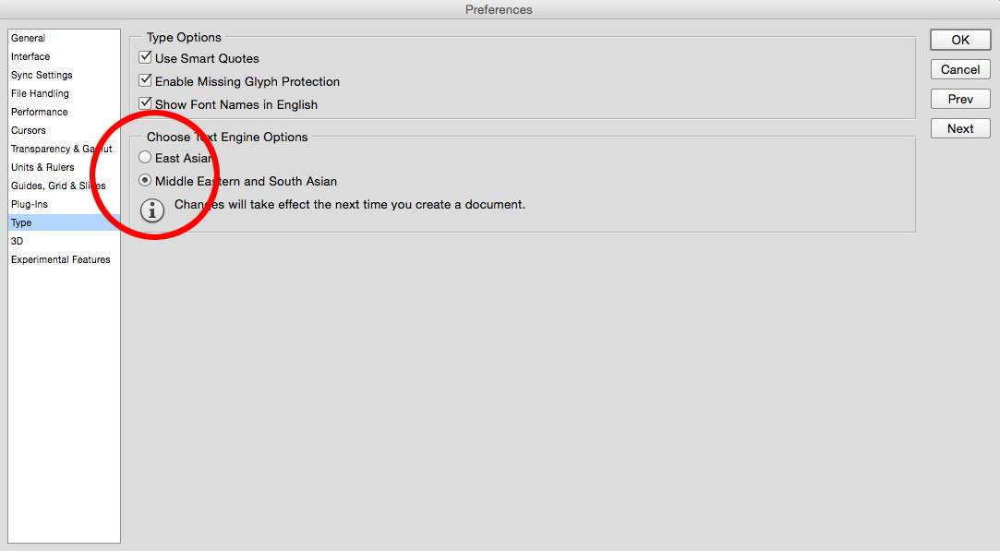
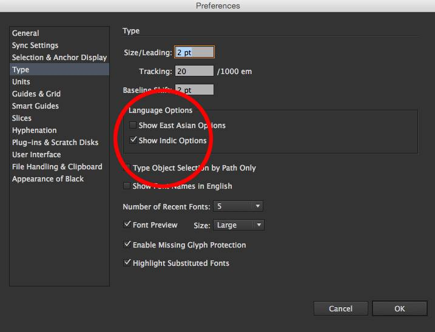
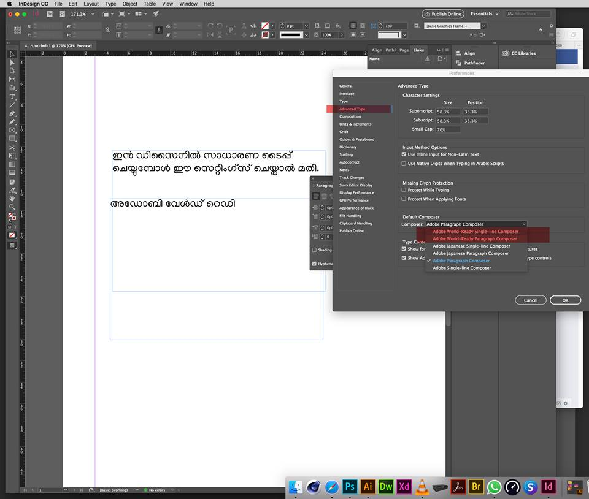
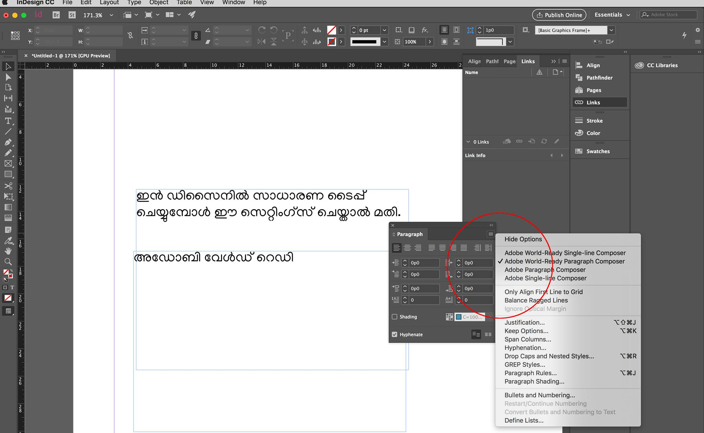

അഡോബിയുടെ സിസി പതിപ്പുകളിൽ മാത്രമാണ് മലയാളം യുണിക്കോഡ് ഉപയോഗിക്കാൻ സാധിക്കുകയുള്ളൂ. അതിൽ തന്നെ പ്രത്യേക സെറ്റിങ്ങ് ആവശ്യവുമാണ്.

Preferences ഓപ്ഷൻ എടുത്തു കഴിഞ്ഞാൽ ചിത്രങ്ങളിലുള്ളതു പോലെ Indic Options (ഇലസ്റ്റ്രേറ്ററിൽ), Middle Eastern and South Asian (ഫോട്ടോഷോപ്പിൽ) സെലക്ട് ചെയ്തു കൊടുക്കുക.

മേൽപ്പറഞ്ഞ കാര്യങ്ങൾക്കൊപ്പം യുണികോഡ് ഫോണ്ടുകൾ, മലയാളം ടൈപ്പിംഗ് ടൂൾ എന്നിവ ഇൻസ്റ്റാൾ ചെയ്യേണ്ടതുണ്ട് എന്നു പ്രത്യേകം പറയേണ്ടതില്ലല്ലോ...
