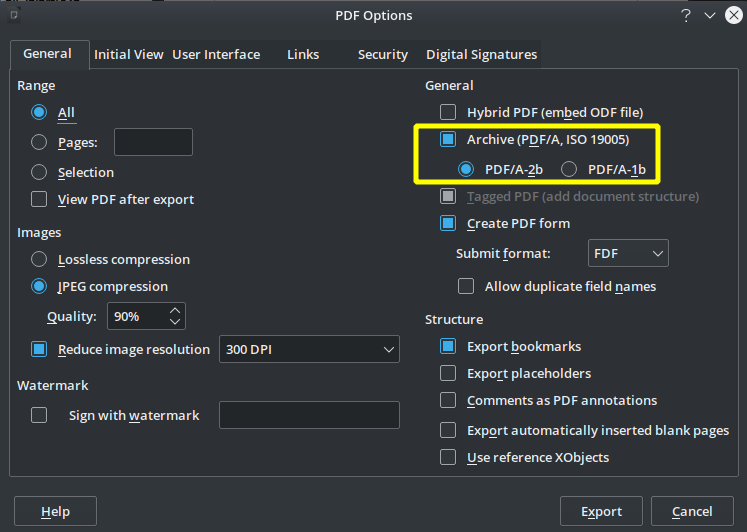

പ്രാഥമികമായി അച്ചടി ആവശ്യത്തിനോ സമാനമായ ഉപയോഗങ്ങൾക്കോ ആണ് പിഡിഎഫ് ഉപയോഗിക്കുന്നത് എന്നതുകൊണ്ട്, അതിലെ ഉള്ളടക്കം പുനരുപയോഗത്തിനു ഉപകരിക്കുന്നരീതിയിലല്ല രേഖപ്പെടുത്തിയിരിക്കുന്നത്. എങ്കിലും ഉള്ളടക്കത്തിൽ നിന്നും ചില ഭാഗങ്ങൾ പകർത്തേണ്ടിവരാറുണ്ട്(copy-paste). അത്തരം സന്ദർഭങ്ങളിൽ മലയാളം ഉള്ളടക്കം പകർത്തുമ്പോൾ മിക്ക അക്ഷരങ്ങളും നഷ്ടപ്പെട്ടുപോകാറുണ്ട്. ഉള്ളടക്കം പകർത്താവുന്ന വിധത്തിൽ പി.ഡി.എഫ്. ഇതിനായി പ്രത്യേകം തയ്യാറാക്കിയെങ്കിലേ ഈ പ്രശ്നം പരിഹരിക്കാനാകൂ.

മലയാളം ഉള്ളടക്കം പകർത്താവുന്ന പി.ഡി.എഫ്. തയ്യാറാക്കാൻ ലിബ്രെഓഫീസ് ഉപയോഗിക്കാവുന്നതാണ്. സാധാരണപോലെ ഡോക്യുമെന്റ് തയ്യാറാക്കിയശേഷം, അതിനെ പിഡിഎഫ് ആക്കുമ്പോൾ [PDF/A](https://en.wikipedia.org/wiki/PDF/A) എന്ന തരത്തിലുള്ള പിഡിഎഫ് ആണ് ഉണ്ടാക്കേണ്ടത്.

`File->Export as... ->Export PDF as...` എന്ന മെനു എടുക്കുക. അവിടെ പി.ഡി.എഫ് ഓപഷനുകളിൽ **Archive(PDF/A, ISO 19005)** എന്ന ഓപ്ഷൻ ടിക്ക് ഇട്ട്, **PDF/A-2b** എന്ന് തിരഞ്ഞെടുക്കുക. തുടർന്ന് എക്സ്പോർട്ട് ചെയ്യുന്ന പിഡിഎഫിൽ നിന്ന് മലയാളം കോപി ചെയ്യാനാകും.

ഇങ്ങനെയുണ്ടാക്കുന്ന പിഡിഎഫുകളുടെ ഫയൽ സൈസ് കുറച്ച് കൂടുതലാകുമെന്നോർക്കുക.

സ്കാൻ ചെയ്ത പിഡിഎഫ് ആണെങ്കിൽ, അത് ചിത്രമായതുകൊണ്ട്, OCR(optical character recognition) പോലുള്ള മാർഗങ്ങൾ ഉപയോഗിക്കേണ്ടിവരും.
